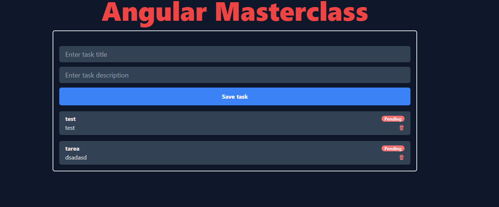

# Todo list anguilar

## Descripción
Este proyecto es una lista de tareas, donde se puede añadir, eliminar y marcar como completada una tarea. Además, se puede filtrar por tareas completadas, pendientes o todas.

## Resultado final

## Tecnologías
- Angular (version 18.1.0)
- Typescript
- HTML
- SASS
- Tailwind
  
## Instrucciones para ver el proyecto en local
### Paso 1
Clona el proyecto en el botón verde que pone **code**

### Paso 2
Pon el comando, dentro de la carpeta del proyecto para instalar todo lo que necesita el proyecto para su funcionamiento
`npm i` o `npm install` o `pnpm i` o `pnpm install`

### Paso 3
Acciona el json-serve para que muestre los datos
` json-server --watch db.json --port 3000`

### Paso 4
Haz correr para ver la app `ng serve`. Navegue hasta `http://localhost:4200/`. La aplicación se recargará automáticamente si cambia alguno de los archivos fuente.

